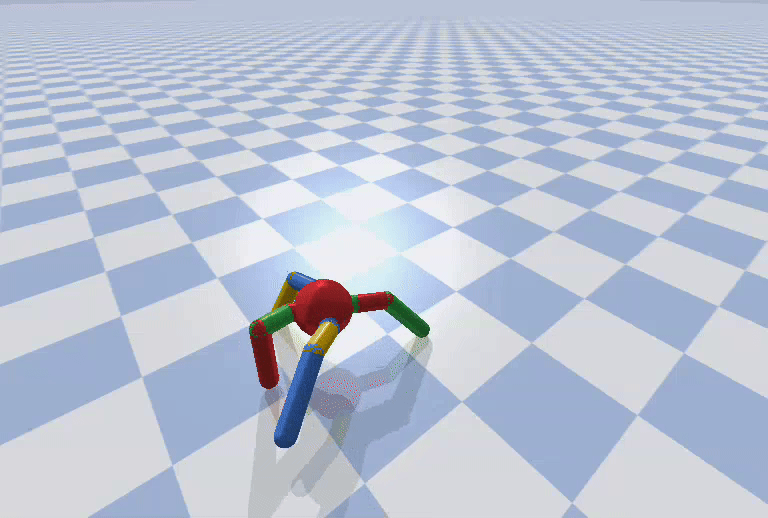

# Robots-can-adapt-like-animals
Minimal Re-implementation of the evolutionary algorithm "Intelligent Trial &amp; Error" by **Cully et al. 2015** (MAP‑Elites + Map‑Based BO) for gait generation and adaption after damage


> **Notes** The env is the bullet‑based Ant from [QDgym](https://github.com/ollebompa/QDgym).
>
| no_damage|
|----------|
|  | 


| back_left_damaged| back_left_right_damaged |
|----------|------------|
| | 
---

> After 200.000 evaluations, 505 of 650 cells are filled

## Project structure

```
./src
    ├─ controller.py          # 16‑param sinusoidal CPG
    ├─ map_elites.py          # offline performance map (parallel‑ready)
    ├─ damaged_ant.py         # wrapper that “kills” a leg
    ├─ mboa.py                # online adaptation (M‑BOA)
```

## Quick start

It is strongly recommended to use a virtual environment

```bash
python3.9 -m venv venv && source venv/bin/activate
```

or with pyenv:

```bash
pyenv virtualenv 3.9 <name-env>
```

```bash
pip install -r requirements.txt
```

```bash
pip install git+https://github.com/ollenilsson19/QDgym.git#egg=QDgym --no-deps
```

> **Why the old NumPy?** QDgym wheels are compiled against 1.19.5.
> If you need a newer stack, re‑compile QDgym or switch to Mujoco.

> **Why Python 3.9?** Same reason: the wheel links against the CPython 3.9 ABI.

### Generate the behavior–performance map

> Approximately 3 hours on 12 cores for 200.000 evals; output saved to map_ant.np. The original paper performed 1.000.000 evals

```bash
python main.py \
  --generate_map \
  --n_evals 200000 \
  --n_jobs 12
  --evaluation_render
```
If `--training_render` to visualize rollouts in PyBullet (disables parallelism).

Other parameters (sigma, batch_size, etc.) are set at the top of map_elites.py.

Parallelism is handled by **joblib** (`n_jobs` inside the script).
Change `N_EVALS`, `SIGMA` or the grid resolution to taste.

### Break a leg & adapt
```bash
python main.py \
  --no-generate_map \
  --map_file map_ant.npz \
  --damaged_leg back_left \
  --max_trials 20
```

```bash
python main.py \
  --no-generate_map \
  --map_file map_ant.npz \
  --damaged_leg back_left back_right \
  --max_trials 20
```


---

## Algorithmic notes

| Phase            | File                  | Key choices                                                                                       |
| ---------------- | --------------------- | ------------------------------------------------------------------------------------------------- |
| **MAP‑Elites**   | `map_elites.py` | 4‑D grid (duty factors) · 5 buckets · Gaussian mutation σ 0.2 · batch 64 · parallel with `joblib` |
| **M‑BOA**        | `mboa.py`            | GP Matérn 5/2, prior = map fitness, UCB κ = 0.05, ρ‑exploration 0.4, candidate‑set top 15 %       |
| **Controller**   | `controller.py`       | 8 amplitudes+ 8 sinusoidal phases, freq 1.5 Hz                                                      |
| **Damage model** | `damaged_ant.py`      | Actions of one or more legs hard‑set to 0 each step                                                        |


@article{cully2015robots,
  title        = {Robots that can adapt like animals},
  author       = {Antoine Cully and Jeff Clune and Danesh Tarapore and Jean-Baptiste Mouret},
  year         = {2015},
  url          = {https://arxiv.org/abs/1407.3501}
}

